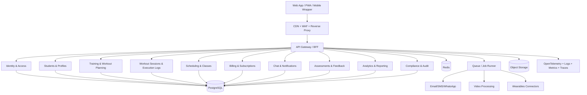
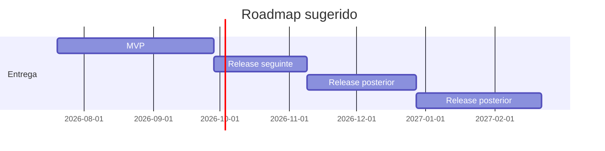

# Relatório analítico para um sistema web de gestão e acompanhamento de treinos para personal trainers e alunos

## Resumo executivo

O produto a ser definido é uma **plataforma SaaS web responsiva, com evolução natural para PWA/mobile companion**, voltada à operação completa de um personal trainer: captação e onboarding de alunos, prescrição e periodização de treinos, execução e registro de sessões, agenda, comunicação, cobrança recorrente, avaliações, analytics e integrações com ecossistemas de saúde e wearables. Esse recorte não é teórico: ele converge com o conjunto de capacidades oferecidas pelos principais produtos do segmento, como Tecnofit Personal, Trainerize e My PT Hub, que combinam cadastro de alunos, prescrição, agenda, acompanhamento, mensageria e financeiro em um mesmo fluxo de trabalho. citeturn1search0turn1search1turn20search1turn20search4turn1search8turn1search9

Como o sistema trata **dados de saúde, biometria, evolução corporal e comportamento de treino**, ele opera sobre **dados pessoais sensíveis** na LGPD. Isso desloca a discussão de “feature checklist” para uma arquitetura orientada por privacidade, trilha de auditoria, minimização de dados, segurança por padrão, exportação/eliminação, governança de consentimento e prontidão para incidentes. A LGPD classifica dados de saúde e biométricos como sensíveis; exige medidas técnicas e administrativas adequadas; assegura direitos do titular; e, em caso de incidente com risco ou dano relevante, exige comunicação à ANPD e ao titular, com manutenção de registro dos incidentes. citeturn22search0turn22search4turn21search2turn2search0turn2search4

A leitura comparativa dos arquivos enviados mostra que a base atual já cobre parte importante do **hardening técnico e da operação inicial** — autenticação, cadastro, alunos, fichas, chat, medidas, worker de tradução, lacunas de segurança, histórico de sessão, aderência, consentimento e health checks — mas ainda está mais próxima de um **monólito funcional de consultoria individual** do que de uma plataforma comercial madura, com billing robusto, governança operacional, multicalendário, backoffice, trilhas legais, automações de negócio e ecossistema de integrações. A comparação foi feita sobre o diagnóstico de lacunas do FitLife Sync fileciteturn0file0 e sobre o documento de arquitetura/telas/rotas da solução atual fileciteturn0file1.

A recomendação objetiva é: **começar por um monólito modular em produção séria**, migrando do desenho atual com SQLite para **PostgreSQL + Redis + storage de objetos**, mantendo edge/CDN, observabilidade e CI/CD desde o MVP. Microserviços só passam a ser economicamente superiores quando houver múltiplos times, domínios com escala distinta ou pressão de integração externa suficientemente alta; a própria AWS ressalta que decomposição em serviços é mais vantajosa quando alinhada a times e ownership independentes. citeturn0file1turn14search8turn16search1turn16search6

Em termos de entrega, o escopo mínimo vendável é um **MVP de 1.400 a 1.700 horas** para uma squad enxuta, seguido de três releases que atacam agenda avançada, billing completo, automações, wearable sync, operação comercial e extensibilidade. O grau de confiança é **alto** em segurança/LGPD/arquitetura-base e **médio** nas estimativas, porque público-alvo exato, orçamento, volume de alunos, SLA contratual e prazo de lançamento não foram especificados.

## Definição do produto, público-alvo, objetivos de negócio e benchmark

Assumindo “não especificado” para nicho comercial, o produto deve ser concebido para três faixas de uso: **personal autônomo**, **equipe pequena de personal trainers** e **operação híbrida presencial + online**. O job-to-be-done principal é simples: ajudar o profissional a **prescrever melhor, acompanhar mais alunos com menos fricção operacional, reduzir inadimplência, aumentar retenção e comprovar resultado**. Essa formulação é coerente com o posicionamento de Tecnofit, que enfatiza cadastro, histórico, anamnese, evolução, agenda e pagamentos; com Trainerize, que enfatiza treino, progresso, hábitos, mensagens e engajamento; e com My PT Hub, que soma onboarding, compliance, agenda, pagamentos e analytics financeiros. citeturn1search0turn1search1turn20search1turn20search4turn1search8turn1search9

Os objetivos de negócio devem ser explicitados em quatro linhas. A primeira é **receita**, por meio de planos recorrentes, redução de churn e expansão do ticket com serviços complementares. A segunda é **eficiência operacional**, reduzindo trabalho manual em agenda, cobrança, troca de mensagens e atualização de treinos. A terceira é **resultado do aluno**, porque adesão e feedback contínuo aumentam valor percebido; revisões acadêmicas mostram que intervenções digitais e mHealth tendem a produzir ganhos em atividade física, e que técnicas como planejamento de ação, metas, automonitoramento e personalização são associadas a melhor adesão e comportamento. A quarta é **compliance e confiança**, indispensáveis em produto que trata dados sensíveis. citeturn19search5turn19search7turn19search0turn18search4turn22search0turn21search2

No benchmark competitivo, há um padrão claro. Os concorrentes líderes não vendem “planilha de treino”; vendem **sistema operacional do relacionamento treinador-aluno**. Tecnofit comunica treino, agenda, financeiro e app do aluno; Trainerize combina treinos, hábitos, progresso, mensagens e pagamentos; My PT Hub enfatiza onboarding, forms/waivers, calendário, compliance, grupos, automações e analytics. Logo, o produto aqui definido precisa ter um núcleo de treino sólido, mas o diferencial real estará em **automação, retenção e operação comercial**. citeturn1search0turn1search1turn20search1turn20search4turn20search3turn1search8turn1search9

A tabela abaixo sintetiza como cada módulo se conecta ao valor de negócio.

| Módulo | Valor primário | Valor secundário | Obrigatório no MVP | Observação estratégica |
|---|---|---|---|---|
| Cadastro e onboarding | Ativação rápida | Menos suporte manual | Sim | Convite por e-mail e aceite de termos |
| Criação e planejamento de treinos | Entrega do serviço principal | Escala da prescrição | Sim | Templates, periodização e versionamento |
| Acompanhamento do aluno | Retenção | Prova de resultado | Sim | Aderência, evolução, check-ins |
| Agenda/aulas | Ocupação da agenda | Menos no-show | Sim | Regras de remarcação e disponibilidade |
| Pagamentos/assinaturas | Receita recorrente | Menos inadimplência | Sim | Cobrança, retry, cancelamento |
| Relatórios/analytics | Decisão operacional | Upsell e retenção | Sim | KPIs por aluno e por carteira |
| Comunicação/mensageria | Engajamento | Suporte e motivação | Sim | Feed, push, automações |
| Avaliações/feedback | Ajuste fino da prescrição | Segurança clínica | Sim | Anamnese, PAR-Q, dor, RPE |
| Wearables/IoT | Valor percebido premium | Dados objetivos | Não | Release posterior |
| Mobile/responsividade | Uso diário | Conversão e retenção | Sim | PWA primeiro, app depois |
| Segurança/LGPD | Viabilidade legal e reputacional | Redução de risco | Sim | Transversal |
| Observabilidade, backup e QA | Continuidade operacional | Menor MTTR | Sim | Transversal |

A síntese acima consolida o padrão de mercado observado em plataformas do segmento e os requisitos legais/técnicos aplicáveis. citeturn1search0turn20search1turn1search8turn22search0turn21search2turn2search0

## Requisitos funcionais detalhados

A melhor forma de modelar o produto é por **domínios funcionais**, não por páginas. Isso reduz retrabalho e facilita priorização por impacto. O quadro abaixo já incorpora os módulos solicitados e indica o que é realmente necessário para um release comercial sério.

| Domínio funcional | Requisitos mandatórios |
|---|---|
| Cadastro | cadastro por convite e autoatendimento; perfis de personal/aluno; validação de e-mail; recuperação de senha; aceite versionado de termos; consentimento LGPD; preferência de comunicação; status de conta e status de vínculo separados |
| Criação e planejamento de treinos | biblioteca de exercícios; exercícios próprios; templates reutilizáveis; montagem por bloco, treino, microciclo e mesociclo; progressão de carga; notas, vídeos e contraindicações; status draft/published/archived; clonagem, versionamento e comparação entre versões |
| Acompanhamento de alunos | prontuário técnico; anamnese; restrições; objetivos; disponibilidade semanal; check-ins; aderência; dias sem treinar; personal bests; volume por exercício; alertas de estagnação e risco de churn |
| Agenda e aulas | disponibilidade do personal; booking pelo aluno; confirmação/reagendamento/cancelamento; regras de antecedência; no-show; aulas individuais e em grupo; lista de espera; lembretes automáticos; sincronização ICS/Google Calendar opcional |
| Pagamentos e assinaturas | planos e pacotes; assinatura recorrente; trial; cupons; cobrança avulsa; retry/dunning; cancelamento e pausa; baixa manual; conciliação de webhooks; reembolso; histórico financeiro por aluno |
| Relatórios e analytics | MRR, inadimplência, churn, LTV simples, taxa de adesão, evolução corporal, frequência, ocupação da agenda, receita por personal, cohort de retenção, funil convite→aluno ativo |
| Comunicação e mensageria | chat 1:1; anexos; leitura; edição/exclusão lógica; indicador digitando; mensagens agendadas; automações por evento; broadcast segmentado; templates; preferências de notificação; histórico auditável |
| Avaliações e feedback | avaliações físicas; fotos de evolução com consentimento; dor, fadiga, sono, humor e RPE pós-treino; feedback por exercício; questionários customizados; reavaliações programadas |
| Integração com wearables/IoT | leitura de passos, FC, sono, calorias e sessões; importação de atividades; vinculação por OAuth; reconciliar treino prescrito x treino executado; política clara de consentimento por fonte |
| Mobile/responsividade | design mobile-first; PWA instalável; modo offline para sessão ativa; sincronização assíncrona; push web/mobile; câmera para anexos e vídeos |
| Segurança e privacidade | RBAC; auditoria; MFA opcional; trilhas de consentimento; limitação de sessão por dispositivo; rate limiting; antifraude em convites e login; CSP; upload seguro; criptografia em trânsito e em repouso |
| Conformidade LGPD | base legal por finalidade; minimização de coleta; retenção; exportação; eliminação/anônimização; atendimento ao titular; política de incidentes; registro de operações de tratamento |
| Escalabilidade e performance | paginação cursor; busca indexada; filas para eventos e notificações; cache; otimização para catálogos, chat e calendário; jobs assíncronos para mídia e analytics |
| Backup/DR | backup automatizado; criptografado; testado; restore drill; RPO/RTO definidos; runbook de desastre |
| Testes, QA, deploy e monitoramento | testes unitários/integrados/E2E; pipelines; ambientes; feature flags; logs, métricas e traces; health checks; alertas; SLOs |

Esse conjunto não é arbitrário. Ele resulta da combinação do padrão funcional dos concorrentes com evidências de que auto-monitoramento, metas, feedback, progressão e interação contínua melhoram adesão e engajamento em intervenções digitais de atividade física. citeturn1search0turn20search1turn1search8turn19search0turn19search4turn19search7turn18search4turn19search5

O fluxo principal de uso, do ponto de vista do negócio, deve ser desenhado assim:

```mermaid
flowchart LR
    A[Personal cria conta] --> B[Configura perfil, planos e agenda]
    B --> C[Convida aluno]
    C --> D[Aluno ativa conta e aceita termos]
    D --> E[Anamnese e avaliação inicial]
    E --> F[Personal cria ou clona plano de treino]
    F --> G[Publica treino]
    G --> H[Aluno executa sessão no web/PWA/mobile]
    H --> I[Registra séries, carga, RPE e feedback]
    I --> J[Sistema recalcula aderência, evolução e alertas]
    J --> K[Personal ajusta prescrição]
    K --> L[Cobrança recorrente e renovação]
```

Esse fluxo operacionaliza exatamente o que o mercado já considera mínimo: onboarding simples, entrega rápida do treino, acompanhamento, comunicação e cobrança integrada. citeturn1search0turn20search4turn1search5turn20search3

Do ponto de vista de priorização interna, alguns requisitos merecem ênfase. **Execução real de treino**, com logs de séries/carga/RPE e trilha histórica, é mais importante do que qualquer “dashboard bonito”, porque é a base dos relatórios de aderência, progressão e retenção. **Agenda com política de remarcação e no-show** é mais importante do que calendário visual sofisticado, porque impacta ocupação e receita. **Billing recorrente com webhooks e dunning** é mais importante do que múltiplos meios de pagamento no início, porque reduz perda financeira. **Mensageria com automações** tende a gerar mais retenção do que chat puramente reativo. Isso é compatível com as capacidades promocionais dos concorrentes e com a evidência de valor de mensagens, planejamento e automonitoramento para adesão. citeturn1search0turn20search0turn1search8turn19search0turn19search4turn19search5

## Requisitos não funcionais, segurança, privacidade, LGPD e integrações técnicas

Em requisitos não funcionais, a meta correta não é “ser bonito” nem “ser rápido”; é ser **simples no uso, robusto na operação e defensável juridicamente**. Em usabilidade, o produto deve reduzir o tempo até a primeira entrega de um treino; em acessibilidade, deve mirar **WCAG 2.2 nível AA**, com navegação por teclado, foco visível, labels corretos, semântica consistente, contraste adequado e mensagens de erro legíveis por tecnologias assistivas. O W3C define WCAG 2.2 como a referência internacional para acessibilidade web, organizada nos princípios perceptível, operável, compreensível e robusto. citeturn3search0turn2search3

Em performance, o alvo recomendado para a aplicação web é operar com **Core Web Vitals em nível bom no percentil 75**: LCP até 2,5 s, INP até 200 ms e CLS até 0,1. Para essa categoria de sistema, isso importa principalmente nas telas de login, dashboard, catálogo de exercícios, agenda e chat. Para disponibilidade, a recomendação prática é um SLO de **99,5% no MVP** e **99,9% a partir do release em que houver redundância real de aplicação e banco**, com definição explícita de RTO e RPO por criticidade operacional. AWS define RTO como o atraso máximo aceitável para restabelecimento do serviço e RPO como a perda de dados máxima aceitável em tempo. citeturn23search3turn23search0turn17search3turn17search4

Na LGPD, este produto deve partir do pressuposto de que **dados de saúde, fotos de evolução, biometria, limitações físicas e perfil comportamental** exigem proteção reforçada. A plataforma precisa mapear finalidade, base legal, retenção e compartilhamentos por categoria de dado; separar dados essenciais de opcionais; registrar consentimentos quando necessário; permitir acesso, exportação, revogação e eliminação conforme cabível; e manter processo de resposta a incidentes. A ANPD esclarece que dados sensíveis têm proteção especial; a LGPD assegura direitos ao titular; e o art. 19 prevê confirmação/acesso simplificado imediatamente ou resposta completa em até 15 dias. citeturn22search0turn22search1turn21search0turn21search2turn2search0

Em segurança técnica, a linha mínima é: autenticação forte, trilha de auditoria, proteção de API e defesa contra abuso. OWASP destaca autorização em nível de objeto como um dos riscos centrais em APIs; NIST reforça que cookies servem para **manutenção de sessão**, não como autenticadores por si mesmos, e recomenda cookies em HTTPS, HttpOnly, escopo mínimo e SameSite; além disso, NIST desencoraja regras arbitrárias de composição de senha e recomenda blocklist, rate limiting e controle de comprometimento. Em termos práticos, a arquitetura deve usar **web com cookie de sessão seguro** e, quando houver app nativo, **tokens curtos + refresh rotacionado**, além de MFA opcional para personais com volume alto de alunos. citeturn11search0turn11search1turn6search4turn6search6

As integrações técnicas recomendadas estão resumidas abaixo.

| Categoria | Opções prioritárias | Recomendação |
|---|---|---|
| OAuth/Identidade | Google, Apple | Authorization Code + PKCE; login social opcional |
| Pagamentos BR | Mercado Pago; Stripe para operação internacional | Mercado Pago primeiro para assinaturas no Brasil; Stripe se houver multi-país |
| E-mail transacional | Resend | Simples, API + SMTP, webhooks e boa DX |
| SMS/WhatsApp | Twilio | Lembretes, OTP, notificações e mensagens ricas |
| Vídeo demonstrativo | Mux | Upload, playback seguro com signed URLs e analytics de vídeo |
| Wearables | Apple HealthKit, Google Health API, Garmin, Polar, Strava | Implementar por camadas, começando por Apple/Google; Strava para endurance |
| Observabilidade | OpenTelemetry + Prometheus/Grafana + Sentry/Axiom/Datadog | OTel para instrumentação e backend de observabilidade a critério de custo |
| Notificações push | Web Push/Firebase/OneSignal | Web Push no PWA; ampliar se houver app nativo |

A base factual para essas opções é sólida: Mercado Pago expõe API nativa de assinaturas recorrentes; Stripe oferece Billing e subscriptions; Resend suporta REST e SMTP; Twilio cobre SMS e WhatsApp; Mux oferece upload direto, playback seguro e analytics; Apple HealthKit e Google Health API são os hubs oficiais para dados de saúde e fitness; Garmin, Polar e Strava oferecem nuvens e APIs próprias; e OpenTelemetry fornece um padrão agnóstico de instrumentação. citeturn5search0turn5search1turn6search1turn5search4turn5search5turn4search2turn10search5turn10search10turn8search0turn7search0turn9search2turn9search0turn7search1turn16search1turn16search6

Em internacionalização, ainda que o produto possa nascer em pt-BR, a modelagem já deve prever **i18n, locale e timezone por usuário**, principalmente porque personal trainers brasileiros frequentemente atendem clientes em outros países. Os próprios casos promocionais do segmento já sinalizam operações com alunos internacionais. citeturn1search3turn10search13

## Arquitetura sugerida e stack tecnológico

Os arquivos enviados descrevem uma base atual em **monólito modular containerizado**, com Nginx, Express, Knex, SQLite, worker de tradução e Cloudflare Tunnel, além de uma superfície funcional já relevante de autenticação, alunos, treinos, chat, perfil e catálogo. Isso é um ponto de partida razoável para protótipo e até para operação pequena, mas não é a melhor base para um produto comercial com billing, analytics, agenda concorrente, wearable sync e histórico transacional mais denso. A evolução correta é **preservar o monólito modular** e substituir os pontos que limitam escala, concorrência, integridade e operação. fileciteturn0file1

A recomendação é esta: **modular monolith como padrão inicial**, com bounded contexts claros — Identity, Students, Training, Sessions, Scheduling, Billing, Messaging, Assessments, Media, Notifications, Analytics e Compliance. A fronteira entre módulos deve ser rígida no código e no banco. Microserviços só entram quando houver justificativa econômica real: times independentes, carga muito distinta por domínio, ou necessidade de isolamento operacional. A orientação da AWS sobre decomposição por serviço/time reforça que microserviços geram custo de coordenação e só valem quando ownership independente é requisito. citeturn14search8

O banco recomendado é **PostgreSQL**; Redis deve entrar para fila, cache, locks distribuídos leves e sessões auxiliares; mídia e anexos devem ir para storage de objetos compatível com S3; busca pode começar com Postgres full-text e migrar para OpenSearch/Meilisearch apenas se o catálogo e analytics exigirem. O modelo atual em SQLite, citado nos arquivos, é um gargalo previsível para concorrência, backup, observabilidade e recuperação operacional, ainda que o documento de lacunas já trate mitigações como WAL, backup seguro e constraints. fileciteturn0file0 fileciteturn0file1

Arquitetura recomendada:

A autenticação deve seguir dois fluxos. Para **web**, sessão por cookie seguro com SameSite, rotação de sessão, invalidação por versão e controles anti-CSRF. Para **integrações e eventual app nativo**, OAuth/OIDC e tokens de curta duração com refresh controlado. Os documentos do Google recomendam **Authorization Code flow com PKCE** para clientes modernos; NIST reforça o papel limitado de cookies e os controles de sessão recomendados. citeturn6search4turn6search6turn11search1

Stack sugerido, com foco em produtividade e risco controlado:

| Camada | Sugestão principal | Alternativa | Justificativa |
|---|---|---|---|
| Frontend web | Next.js + TypeScript + React + TanStack Query + React Hook Form + Zod | Vue/Nuxt | SSR parcial, boa DX, PWA e ecossistema maduro |
| UI | Tailwind + Radix/UI + shadcn/ui | Material UI | Velocidade e acessibilidade |
| Backend | NestJS ou Fastify/Express com TypeScript | Laravel, Django | TypeScript ponta a ponta e boa modularização |
| Banco | PostgreSQL | MySQL | Consistência, JSONB, índices, extensões, robustez transacional |
| Cache/Fila | Redis + BullMQ/Temporal-lite | RabbitMQ | Simplicidade operacional inicial |
| Storage | S3/Cloudflare R2/MinIO | GCS | Mídia, anexos, backups e exportações |
| Vídeo | Mux | Cloudinary/Vimeo | Segurança e pipeline de mídia |
| Mobile | PWA primeiro; React Native se app nativo virar prioridade | Flutter | Melhor custo-benefício no início |
| Infra | Docker + ECS/Fargate, Fly.io, Railway, Render ou Kubernetes apenas depois | — | Menor complexidade inicial |
| CI/CD | GitHub Actions | GitLab CI | Fácil, maduro e integrado |
| Observabilidade | OpenTelemetry + Grafana/Prometheus + Sentry | Datadog/New Relic | Stack enxuta e escalável |
| Pagamento | Mercado Pago | Stripe | Melhor aderência inicial ao mercado BR |

As capacidades de GitHub Actions para build, test e deploy, e a instrumentação padronizada via OpenTelemetry, sustentam um pipeline de entrega contínua sem lock-in excessivo. citeturn14search0turn14search4turn16search1turn16search6

## Priorização, estimativa de esforço, backlog do MVP e roadmap

Como prazo e orçamento não foram especificados, a priorização deve seguir uma matriz simples e objetiva: **Impacto de negócio x Complexidade de entrega**, com um terceiro desempate por **redução de risco**. Em fórmula curta: **Prioridade = (Impacto + Risco Reduzido + Dependências Destravadas) / Complexidade**. Isso evita o erro comum de superinvestir em features vistosas antes de resolver aderência, cobrança e segurança.

O backlog do MVP abaixo foi montado para um cenário realista: uma squad com 1 product lead/analista, 1 designer parcial, 2 devs frontend, 2 devs backend, 1 QA compartilhado e 1 DevOps compartilhado. Os números são estimativas de engenharia+QA+integração e têm confiança **média**.

| Epic do MVP | Impacto | Complexidade | Estimativa | Prioridade |
|---|---:|---:|---:|---|
| Autenticação, onboarding, aceite de termos e RBAC básico | Alta | Média | 120 h | P0 |
| Cadastro de alunos, perfis, vínculo e prontuário inicial | Alta | Média | 100 h | P0 |
| Biblioteca de exercícios + criação/clonagem de fichas | Alta | Média | 180 h | P0 |
| Execução real de treino com logs, carga, reps e RPE | Alta | Média | 140 h | P0 |
| Anamnese, avaliações, medidas e fotos com consentimento | Alta | Média | 110 h | P0 |
| Agenda básica com disponibilidade, booking e lembretes | Alta | Média | 110 h | P0 |
| Pagamentos recorrentes básicos + webhooks | Alta | Média | 130 h | P0 |
| Mensageria 1:1, notificações e mensagens automáticas simples | Alta | Média | 110 h | P0 |
| Dashboard e analytics básicos de aderência e agenda | Alta | Baixa | 80 h | P1 |
| Segurança/LGPD baseline, exportação e anonimização | Alta | Média | 130 h | P0 |
| Responsividade/PWA base e offline da sessão ativa | Média | Média | 120 h | P1 |
| Observabilidade, testes E2E e CI/CD | Alta | Média | 170 h | P0 |

**Subtotal estimado do MVP:** **1.400 h**.  
**Reserva recomendada de 15% a 20% para integração, retrabalho e QA exploratório:** **210 a 280 h**.  
**Faixa total recomendada:** **1.610 a 1.680 h**.

O MVP concentra o que efetivamente gera receita e retenção: treino, acompanhamento, agenda, cobrança, comunicação e base legal/técnica. Isso está alinhado tanto ao benchmark competitivo quanto ao estado atual observado nos arquivos enviados. citeturn1search0turn20search1turn1search8 fileciteturn0file0 fileciteturn0file1

Roadmap sugerido:

| Release | Escopo principal | Estimativa | Objetivo |
|---|---|---:|---|
| MVP | núcleo operacional: onboarding, treino, execução, agenda, cobrança básica, chat, avaliações, PWA base, LGPD baseline | 1.610–1.680 h | Lançar operação vendável |
| Release seguinte | agenda avançada, dunning, regras de remarcação/no-show, broadcast, relatórios financeiros, templates avançados, auditoria | 700–900 h | Aumentar eficiência e receita |
| Release posterior | wearables, push avançado, grupos/aulas coletivas, desafios, automações por evento, vídeo seguro, cohort analytics | 850–1.050 h | Aumentar retenção e diferenciação |
| Release posterior | backoffice/admin, API/webhooks, multi-personal/co-trainer, white-label inicial, fiscal/invoice flows, permissões granulares | 900–1.200 h | Escala comercial e integrabilidade |

Timeline visual sugerida:

Se a squad efetiva for menor, a compressão de escopo deve ocorrer nesta ordem: primeiro adiar wearable, grupos, video feature rica e white-label; depois reduzir automações sofisticadas; **nunca** cortar observabilidade, backup, segurança e compliance, porque isso troca velocidade de curto prazo por risco estrutural alto. A ANPD exige medidas adequadas de segurança e processo de comunicação de incidentes; backup/DR também precisa ser explícito, com RTO/RPO definidos e restauração testada. citeturn21search2turn2search0turn17search3turn15search6

Os riscos centrais e respectivas mitigação são estes:  
**escopo excessivo no MVP**, mitigado por foco em receita e aderência; **arquitetura subdimensionada**, mitigada por migração imediata para Postgres e filas; **passivo LGPD**, mitigado por privacy-by-design e inventário de dados; **inadimplência e chargeback**, mitigados por gateway com webhooks, dunning e trilha financeira; **baixa adesão do aluno**, mitigada por feedback, metas, lembretes, progresso visível e mensageria; **custo operacional de mídia e notificações**, mitigado por quotas, compressão, políticas de retenção e feature flags. Evidências de mHealth e wearables sugerem que metas, feedback, automonitoramento e uso de trackers têm efeito positivo, embora não milagroso, sobre atividade física e adesão. citeturn19search7turn19search4turn18search4turn19search5

Os KPIs de sucesso recomendados devem ser medidos desde o MVP: taxa de ativação de convite, tempo até primeiro treino publicado, tempo até primeira sessão concluída, aderência semanal, alunos em risco, ocupação da agenda, no-show rate, MRR, inadimplência, churn mensal, retenção por coorte, CAC payback se houver aquisição paga, NPS/CSAT, taxa de resposta do personal, erro por release, p95 de APIs críticas, sucesso de jobs assíncronos e MTTR. Mensurar só “cadastros” é insuficiente; o sinal real do produto é **aluno ativo, pagante e aderente**.

## Comparação com os arquivos enviados e funcionalidades adicionais não catalogadas

Os arquivos mostram que já existe uma cobertura razoável de fundamentos: autenticação, cadastro, estudantes, workouts, medidas, catálogo, chat, perfil, SSE, várias rotas de API e um conjunto importante de lacunas técnicas já mapeadas, incluindo CSRF, reset de senha, onboarding, IDOR, verificação de e-mail, rate limit combinado, backups corretos, locks do SQLite, paginação, timezone, arquivos órfãos, optimistic locking, sessões de treino persistidas, statuses de ficha, lifecycle de vínculo, anamnese, aderência, progressão, offline/idempotência, consentimento LGPD, health checks, sessões por dispositivo e plano mínimo de testes. Isso está documentado no diagnóstico de lacunas fileciteturn0file0 e na arquitetura/telas/rotas atuais fileciteturn0file1.

O ponto crítico é outro: mesmo com boa parte do **hardening técnico já percebido**, o material ainda não cobre, ou cobre apenas indiretamente, várias capacidades que produtos maduros do segmento usam para vender, reter e operar em escala. Em outras palavras, o sistema já conhece muitos riscos de engenharia, mas ainda não internalizou totalmente a camada de **produto comercial**.

As funcionalidades adicionais abaixo são as mais prováveis de estarem **não catalogadas** ou **subespecificadas** no arquivo de lacunas, justamente porque não aparecem de forma clara nos dois documentos comparados e são recorrentes em plataformas maduras do mercado:

| Funcionalidade adicional | Por que importa | Prioridade |
|---|---|---|
| RBAC granular por função | separar dono, personal, assistente, financeiro, suporte e co-trainer reduz risco operacional e permite operação em equipe | Alta |
| Página pública de agendamento | reduz fricção comercial e acelera conversão de leads em alunos | Alta |
| Regras de lista de espera, no-show e política de cancelamento | impacta ocupação da agenda e receita | Alta |
| Waivers, PAR-Q, termos e assinatura eletrônica | reduz risco legal e melhora onboarding | Alta |
| Billing lifecycle completo | cupons, trial, pausa, troca de plano, retry, dunning, chargeback, reembolso e histórico fiscal | Alta |
| Centro de preferências de notificações | evita spam, melhora entregabilidade e reduz churn por ruído | Alta |
| Push notifications web/mobile | melhoram retorno ao app e aderência | Alta |
| Templates/versionamento avançado de treino | comparar versões, rollback, biblioteca própria por personal | Alta |
| Check-in de prontidão | sono, dor, fadiga, humor, DOMS e readiness antes do treino | Alta |
| Backoffice operacional | suporte, impersonation controlado, trilha de auditoria, moderação e gestão de incidentes | Alta |
| CRM de leads e indicações | transforma o produto em motor de aquisição, não só operação | Média |
| Programas de grupo, desafios e rankings | retenção e engajamento comunitário | Média |
| Video call/live session | atende consultoria remota e avaliações online | Média |
| Cobrança e venda por links/checkout | acelera aquisição via redes sociais e site próprio | Média |
| API pública e webhooks | integra parceiros, BI e ecossistema externo | Média |
| Multicalendário e sincronização externa | essencial quando o personal atende em vários locais ou plataformas | Média |
| White-label inicial | útil para assessorias e equipes, mas não para o MVP | Baixa |
| Invoicing fiscal/NFS-e | importante em operação formal maior, mas pode esperar | Baixa |

A origem dessas recomendações é dupla. Primeiro, são lacunas por comparação direta com os documentos enviados, que não detalham esses fluxos de forma explícita. Segundo, são capacidades efetivamente usadas no mercado: My PT Hub destaca onboarding automatizado, forms/waivers, grupos, compliance, agenda e financeiro; Trainerize trabalha hábitos, grupos, mensagens automáticas, links de venda e Stripe integrado; Tecnofit enfatiza agenda, avaliações, cobr anças e recorrência. fileciteturn0file0 fileciteturn0file1 citeturn1search1turn1search8turn1search9turn20search0turn20search3turn20search4

A lacuna mais subestimada é **governança operacional**. Muitos produtos de treino evoluem bem em prescrição e chat, mas falham em três pontos que o usuário final não vê de imediato: backoffice, trilha de auditoria e ciclo completo de cobrança. Esses três itens são os que se tornam caros demais para adicionar “depois”, porque atravessam identidade, financeiro, suporte, compliance e analytics.

A segunda lacuna subestimada é **readiness e feedback estruturado**. O sistema atual já caminha para logs e aderência, mas falta um mecanismo orientado à decisão do personal antes e depois da sessão: dor, fadiga, sono, humor, motivação, RPE, observações por exercício e gatilhos de ajuste. Em termos de valor, isso é mais relevante do que empilhar widgets na dashboard, porque melhora prescrição e percepção de cuidado.

A terceira lacuna subestimada é **motor de automação de negócio**. Mensagem automática agendada, lembrete de renovação, alerta de aluno inativo, cobrança com retry, follow-up pós-avaliação, convite de reengajamento e campanhas segmentadas criam alavancagem que o concorrente comum explora muito bem. Sem isso, o sistema vira ferramenta operacional; com isso, vira produto de crescimento.

## Síntese final orientada à decisão

Se o objetivo é lançar um sistema comercialmente defendível, a definição correta do produto é: **plataforma de operação e retenção para personal trainers**, não apenas editor de fichas de treino. O núcleo obrigatório é treino + execução + acompanhamento + agenda + cobrança + comunicação + compliance. O desenho atual já oferece base funcional e bom diagnóstico de riscos técnicos, mas precisa evoluir para stack e arquitetura mais robustas, com PostgreSQL, filas, storage, observabilidade e uma camada de produto mais orientada a receita, retenção e governança. fileciteturn0file0 fileciteturn0file1

A melhor decisão arquitetural hoje é **monólito modular com fronteiras rígidas**, não microserviços; a melhor decisão de produto é **MVP com billing, agenda e aderência fortes**, não feature sprawl; e a melhor decisão de compliance é **LGPD embutida desde o primeiro release**, porque há tratamento de dados sensíveis de saúde e biometria. citeturn14search8turn22search0turn21search2

A consequência prática é direta. Se houver restrição severa de prazo, preserve estes itens: onboarding por convite, aceites legais, treino com logs reais, avaliações, agenda básica, cobrança recorrente com webhooks, mensageria, exportação/anônimização, backup testado, observabilidade e CI/CD. Todo o resto — wearable, grupos, white-label, marketplace, automações sofisticadas e integrações avançadas — pode ser empurrado para as releases seguintes sem destruir a proposta de valor. Esse recorte maximiza resultado com risco controlado.

---

## Consolidação dos Detalhes Técnicos e Funcionais Mapeados (MVP Gaps)

Com base nas análises mais recentes do ecossistema e nas correções de premissas técnicas, foram adicionados e mapeados os seguintes requisitos críticos para implementação:

### 1. Operações Completas de Edição (CRUD Avançado)
*   **Rotas Mapeadas**:
    *   `PATCH /api/personal/students/:studentId` (atualização cadastral de alunos).
    *   `PATCH /api/workouts/:workoutId` (edição de metadados da ficha).
    *   `PATCH /api/workout-exercises/:workoutExerciseId` (modificação de repetições, carga, descanso, séries e observações).
    *   `PUT /api/workouts/:workoutId/exercises/reorder` (salvamento de `display_order` pós drag-and-drop).
    *   `PATCH /api/measurements/:measurementId` e `DELETE /api/measurements/:measurementId` (correções e exclusões de registros biométricos).
    *   `POST /api/workouts/:workoutId/duplicate` (duplicação ágil de templates de treino).

### 2. Estados de Publicação da Ficha de Treino
*   **Estados**: `draft` (rascunho editável apenas pelo Personal Trainer), `published` (publicado e visível para o aluno), `archived` (histórico de planilhas antigas e desativadas).
*   **Fluxo**: Quando uma nova ficha é publicada, a versão anteriormente ativa do aluno é movida automaticamente para o estado `archived`. Permite agendamento de publicações, definição de data de início/término e rollback para versões anteriores.

### 3. Ciclo de Vida do Aluno e Vínculo Profissional
*   **Estados do Aluno**: `invited` (convidado aguardando ativação), `active` (treinando ativamente), `paused` (acesso limitado de leitura ao histórico, sem chat ou novos treinos), `archived` (soft-deleted), `blocked` (bloqueio por inadimplência ou restrições de saúde).
*   **Segregação**: O status da conta global do usuário é separado do status de seu vínculo profissional com o Personal Trainer, evitando que o encerramento do contrato de consultoria apague ou inutilize permanentemente o perfil e histórico de medidas do aluno.

### 4. Anamnese, Restrições e Objetivos
*   **Tabela `student_assessments`**: Registra o objetivo principal, nível de experiência desportiva, disponibilidade semanal, limitações motoras, lesões clínicas, exercícios contraindicados, equipamentos acessíveis e preferências.
*   **Privacidade**: Campo de anotações médicas privadas do Personal Trainer separado do campo de observações visíveis para o aluno.

### 5. Acompanhamento de Aderência e Performance
*   **Aderência Semanal**: `aderência = treinos concluídos / treinos previstos`. O dashboard do personal deve permitir ordenação por alunos com menor aderência, maior tempo sem treinar, avaliações atrasadas e mensagens não lidas.
*   **Progressão**: Acompanhamento de carga, repetições, volume total (`séries × repetições × carga`) e RPE por exercício. O frontend exibe a última carga executada como sugestão padrão na tela do aluno.

### 6. Temporizador e Modo Offline
*   **Temporizador**: Registros de tempo de descanso entre séries com persistência na tabela de execução (`started_at`, `last_activity_at`, `duration_seconds`).
*   **Internet Instável**: Fila local de logs no cliente (`IndexedDB`) e uso de cabeçalho `Idempotency-Key` contendo um UUID único nas requisições mutáveis da API para evitar registros duplicados em reconexões lentas.

### 7. Gerenciamento Administrativo de Chaves
*   **CLI de Produção**:
    *   `npm run access-key:create` (gerar novas chaves de cadastro de personais).
    *   `npm run access-key:list` (consultar chaves geradas, vigência e contas vinculadas).
    *   `npm run access-key:revoke` (revogar chaves inativas).