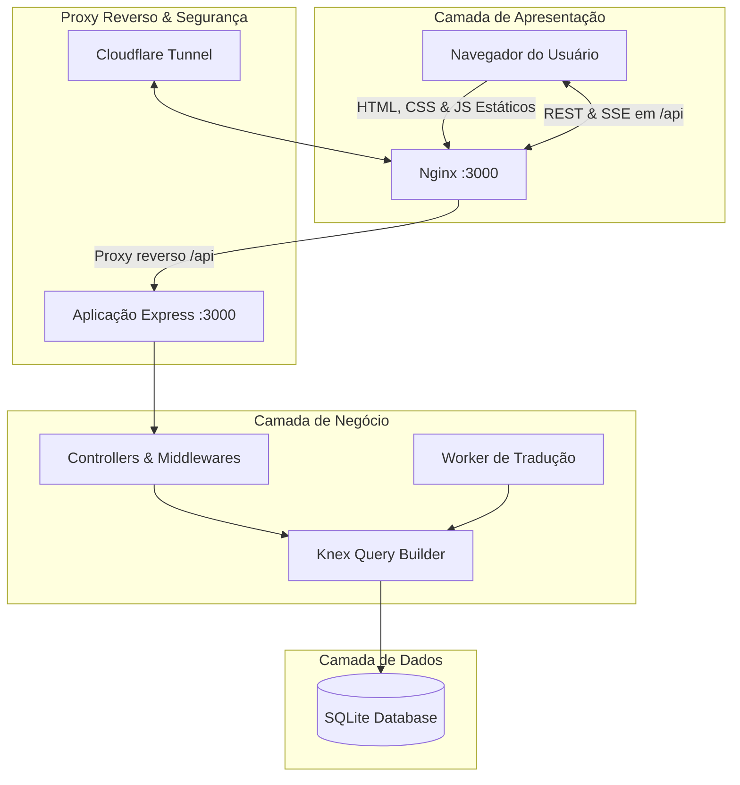

# Arquitetura do FitLife Sync

Este documento detalha a arquitetura do sistema, dividida entre sua infraestrutura física, fluxo de persistência, detalhamento completo das telas do frontend (com seus respectivos elementos e interações) e as rotas correspondentes no backend.

---

## 1. Visão Geral do Sistema



### Processos no Docker Compose
O sistema opera como um **monólito modular conteinerizado** composto por quatro serviços:
1. **`web`**: Servidor Nginx que gerencia o roteamento de arquivos estáticos da pasta `frontend/` e atua como proxy reverso para o backend.
2. **`app`**: API Node.js/Express contendo todas as regras de negócio e acesso ao banco de dados.
3. **`translation-worker`**: Processo em background que consome a fila de exercícios e realiza tradução progressiva de termos.
4. **`cloudflared`**: Agente local que estabelece um túnel seguro de saída com a Cloudflare, expondo o Nginx de forma pública sem abrir portas no roteador.

---

## 2. Infraestrutura e Persistência

### Nginx
- Serve estáticos do frontend.
- Encaminha `/api/` para a aplicação.
- Suporta fluxos contínuos Server-Sent Events (SSE) sem buffering e com timeout expandido para 75s.
- Normaliza o IP do cliente (`CF-Connecting-IP`).

### SQLite & Knex
- Banco relacional leve armazenado em `/app/data/database.sqlite`.
- Gerenciamento de alterações no schema via Migrations do Knex.
- Carga de exercícios padrão de forma transacional no cadastro.

---

## 3. Detalhamento de Telas (Frontend)

Esta seção divide o sistema em telas e define seus elementos, botões e comportamentos interativos.

### 3.1. Tela de Autenticação (Login e Cadastro)
*Acesso público inicial para usuários e novos personais.*

- **Objetivo**: Permitir a autenticação de contas existentes e o registro transacional de novos Personal Trainers usando uma chave de acesso segura.

#### 3.1.1. Elementos e Controles de Interface
- **Seletor de Abas (Tablist)**:
  - Botão de aba `Entrar` (`#tab-btn-login`, `role="tab"`, `data-action="switch-auth-tab"`, `data-tab="login"`). Ativo por padrão.
  - Botão de aba `Criar Conta Personal` (`#tab-btn-register`, `role="tab"`, `data-action="switch-auth-tab"`, `data-tab="register"`).
  - Comportamento: Alterna a classe `hidden` dos formulários e gerencia os atributos `aria-selected` ("true"/"false") para fins de acessibilidade.
- **Formulário de Login (`#login-form`)**:
  - **Campo E-mail** (`#login-email`): Tipo `email`, `required`, `autocomplete="email"`, `inputmode="email"`.
  - **Campo Senha** (`#login-password`): Tipo `password`, `required`, `autocomplete="current-password"`.
  - **Revelador de Senha**: Botão (`.password-toggle`, `data-action="toggle-password"`, `data-target="login-password"`) com ícone Lucide `eye`/`eye-off`, gerenciando dinamicamente `aria-pressed` e mudando o tipo do input entre `password` e `text`.
  - **Exibição de Erro**: Parágrafo (`#login-form-error`, `.form-error`, `role="alert"`, `aria-live="assertive"`), inicialmente com a classe `hidden`.
  - **Botão de Envio**: Botão (`type="submit"`, com atributos `data-default-label="Acessar Painel"` e `data-loading-label="Entrando..."`).
- **Formulário de Cadastro (`#register-form`)**:
  - **Campo Nome Completo** (`#reg-name`): Tipo `text`, `required`, `autocomplete="name"`.
  - **Campo E-mail** (`#reg-email`): Tipo `email`, `required`, `autocomplete="email"`, `inputmode="email"`.
  - **Campo Senha** (`#reg-password`): Tipo `password`, `required`, `minlength="10"`, `maxlength="128"`, `autocomplete="new-password"`. Contém botão local para alternar visibilidade (`data-target="reg-password"`).
  - **Campo Chave de Acesso** (`#reg-access-key`): Tipo `text`, `required`, `autocomplete="off"`, `spellcheck="false"`.
  - **Exibição de Erro**: Parágrafo (`#register-form-error`, `.form-error`, `role="alert"`, `aria-live="assertive"`), inicialmente oculto.
  - **Botão de Envio**: Botão (`type="submit"`, com atributos `data-default-label="Cadastrar-se como Personal"` e `data-loading-label="Criando conta..."`).

#### 3.1.2. Fluxo de Validação e Comportamentos (Frontend)
1. **Controle de Submissão Concorrente**: Ao submeter qualquer formulário, a rotina JavaScript verifica se `form.dataset.submitting === 'true'`. Caso positivo, aborta o processamento para evitar disparos duplicados.
2. **Preparação**: Define `form.dataset.submitting = 'true'`, adiciona a classe `loading` ao botão de submit, altera o texto do botão para o valor contido em `data-loading-label` e remove a classe `hidden` do elemento de erro invocando `clearFormError()`.
3. **Chamada de API**:
   - Para login, faz requisição `POST /api/auth/login` enviando `{ email, password }`.
   - Para cadastro, faz requisição `POST /api/auth/register` enviando `{ name, email, password, accessKey }`.
4. **Tratamento de Resposta e Sessão**:
   - Em caso de **sucesso**: Armazena o objeto retornado (ex: `{ id, name, email, role }`) no cache do `localStorage` chamando `API.saveSession(user)`, apresenta uma notificação toast de sucesso e inicializa a aplicação chamando `setupAppShell(user)` para exibir o painel correspondente ao papel (`role`).
   - Em caso de **erro**: Captura a mensagem de erro retornada pela API, remove a classe `hidden` de seu respectivo elemento de erro (`#login-form-error` ou `#register-form-error`) renderizando a mensagem de forma segura e exibe um toast de erro.
5. **Finalização**: Remove a classe `loading` do botão de submit, restaura o rótulo original usando `data-default-label` e define `form.dataset.submitting = 'false'`.

#### 3.1.3. Processamento e Regras de Validação (Backend)
- **Rate Limiting**: Requisições para `/api/auth/login` e `/api/auth/register` passam por middlewares de limitação de taxa baseados no endereço IP do cliente (normalizado via Nginx/Cloudflare) para mitigar ataques de força bruta.
- **Normalização de Dados**: O e-mail fornecido é normalizado (removendo espaços sobressalentes e convertendo todas as letras para minúsculo) antes de qualquer checagem no banco de dados.
- **Validação de Chave de Cadastro (Access Key)**:
  - O backend verifica a validade da chave enviada. A chave é buscada na tabela `registration_keys` usando o hash correspondente.
  - Se a chave for inexistente, já tiver sido utilizada (`used_at IS NOT NULL`) ou se estiver expirada (`expires_at < CURRENT_TIMESTAMP`), retorna `403 Access Key Inválida`.
  - A marcação da chave como usada e o cadastro do usuário são executados dentro de uma **transação atômica** (`db.transaction`). Caso qualquer parte falhe, a transação sofre rollback total, impedindo que chaves sejam gastas sem a criação correspondente do usuário.
- **Carga de Dados Padrão (Seed)**: Logo após a inserção bem-sucedida do Personal Trainer na tabela `users` com o papel de `personal`, o backend executa transacionalmente o seed do catálogo padrão (inserção de 1.324 exercícios padrão associados ao ID do novo Personal na tabela `exercises`).
- **Criptografia**: As senhas são criptografadas antes de serem armazenadas no banco de dados usando `bcryptjs` com custo de salt igual a 10.
- **Gerenciamento de Cookies (JWT)**: Em caso de sucesso na autenticação, o backend gera um token JWT assinado contendo o ID e papel do usuário, e o define na resposta HTTP por meio de cookies seguros (`HttpOnly`, `Secure`, `SameSite=Strict`), impedindo o acesso ou leitura de credenciais de sessão através de scripts JavaScript client-side.

---


### 3.2. Dashboard do Personal Trainer
*Área restrita de gerenciamento e monitoramento de alunos e treinos.*

#### 3.2.1. Central de Alunos (Lista e Busca)
- **Objetivo**: Listagem de todos os alunos cadastrados vinculados ao Personal autenticado, oferecendo ferramentas de busca fluida, filtragem por ordenação e indicadores de alertas.
- **Elementos de Interface**:
  - **Campo de Busca** (`#students-search`): Caixa de pesquisa instantânea.
  - **Controle de Ordenação** (`#students-sort`): Menu de seleção (`select`) com as opções:
    - `name-asc`: Nome A–Z (ordem alfabética crescente).
    - `name-desc`: Nome Z–A (ordem alfabética decrescente).
    - `unread`: Quantidade de mensagens não lidas no chat central.
  - **Grid de Exibição** (`#students-grid`): Área de renderização dos cartões dos alunos. Possui skeletons dinâmicos (`renderLoadingSkeletons`) com efeito de pulsação CSS durante chamadas assíncronas.
- **Comportamentos e Fluxos**:
  - **Carregamento Inicial**: A rotina `loadPersonalStudents` faz uma requisição `GET /personal/students`. Em caso de grid vazio, exibe um painel de estado vazio (empty state) com um botão de atalho interativo para cadastrar o primeiro aluno.
  - **Processamento de Dados**:
    - Calcula dinamicamente a idade a partir da coluna `birth_date` do aluno em relação à data atual.
    - Identifica mensagens pendentes de visualização por aluno e anexa um balão com contador numérico de mensagens não lidas (`.badge-unread-chat`) no canto do cartão.
    - Atualiza os contadores do cabeçalho da página: Total de Alunos cadastrados (`#stat-total-students`) e total geral de mensagens não lidas acumulado (`#stat-unread-messages`).
  - **Mecanismo de Busca**: A função `filterPersonalStudents` realiza uma filtragem local sem requisições adicionais à API. Ela converte o valor digitado e os atributos do cartão em uma representação normalizada sem acentos ou caracteres especiais (`normalizeListSearch`), ocultando os cartões que não contenham o termo de busca. Em caso de busca sem resultados, ativa a visibilidade de um aviso (`#students-search-empty`).
  - **Mecanismo de Ordenação**: A função `sortPersonalStudents` rearranja os elementos DOM filhos do grid diretamente com base nos atributos `data-sort-name` ou `data-unread`.

---

#### 3.2.2. Modal "Cadastrar Novo Aluno" (Aba de Criação)
- **Objetivo**: Formulário para inserção de novos alunos à base do Personal Trainer.
- **Elementos de Interface**:
  - **Formulário** (`#create-student-form`): Com classe de feedback visual e prevenção de submissão dupla.
  - **Campos**:
    - Nome Completo (`#new-student-name`, `required`).
    - E-mail (`#new-student-email`, tipo `email`, `required`).
    - Senha Provisória (`#new-student-password`, tipo `password`, `required`, minlength 10).
    - Data de Nascimento (`#new-student-birth`, tipo `date`, opcional).
    - Altura (`#new-student-height`, tipo `number`, `step="0.01"`, min 1.00, max 2.50).
    - Peso Meta (`#new-student-target`, tipo `number`, `step="0.1"`, min 30, max 200).
- **Validação e Integração**:
  - A submissão dispara `handleCreateStudent`. O frontend desabilita novas tentativas via flags de envio e dispara requisição `POST /personal/students`.
  - O backend valida a unicidade do e-mail normalizado, criptografa a senha provisória com salt bcrypt de 10 rodadas e cria transacionalmente o registro na tabela `users` (`role = 'student'`) e na tabela `student_profiles` (armazenando as medidas basais e dados pessoais).
  - Em caso de sucesso, o formulário é limpo e a navegação retorna para a listagem principal atualizada.

---

#### 3.2.3. Painel de Detalhes do Aluno (Modal de Acompanhamento)
- **Objetivo**: Modal centralizado que abre através da rota `/student/:id` (ou clique no botão "Acompanhar Aluno"). Centraliza o controle de prescrição de exercícios, acompanhamento biométrico e histórico de peso.
- **Elementos de Cabeçalho**:
  - Avatar do aluno (`#modal-sd-avatar`), Nome (`#modal-sd-name`), E-mail (`#modal-sd-email`), além de metadados em tags para altura (`#modal-sd-height`), peso ideal/meta (`#modal-sd-target`) e idade calculada (`#modal-sd-age`).
  - Botão `Redefinir Senha do Aluno` (`data-action="reset-password"`).
- **Sub-Abas de Navegação (Subtabs)**:
  - Botões para alternar entre as abas internas do modal: **Ficha de Treino** (`#modal-tab-workouts`) e **Medidas e Evolução** (`#modal-tab-metrics`).

##### A. Aba: Ficha de Treino (`#modal-subpane-workouts`)
- **Visualização das Fichas**: Renderiza os treinos na área `#modal-workouts-list`. Cada ficha é renderizada em um cartão (`.workout-card`) com cabeçalho contendo o nome do treino, descrição opcional e os botões `Exercício` (para adicionar) e `Excluir Treino`.
- **Criação de Ficha**: O botão `Criar Ficha de Treino` abre o modal secundário `#modal-create-workout`. A submissão chama `POST /personal/students/:id/workouts` passando o nome da ficha (ex: "Treino A - Hipertrofia") e descrição opcional.
- **Prescrição e Adição de Exercício**:
  - O botão `Exercício` abre o modal `#modal-add-exercise`. O menu de seleção do exercício (`select`) é agrupado dinamicamente usando tags HTML `<optgroup>` com base no grupo muscular (ex: Pernas, Costas, Peito).
  - O formulário requer a quantidade de Séries (`#add-ex-sets`), repetições (`#add-ex-reps`), carga sugerida (`#add-ex-weight`), tempo de descanso (`#add-ex-rest`) e notas de execução adicionais (`#add-ex-notes`).
  - Dispara requisição `POST /personal/students/:id/workouts/:workoutId/exercises`.
- **Visualização de Execução (GIF/Instrução)**: Se o exercício possui mídia cadastrada, anexa o botão `Execução`, que abre um modal com a animação demonstrativa (`gif_url`) e a descrição técnica do movimento.
- **Remoção de Elementos**:
  - A exclusão de treinos completos (`DELETE /personal/students/:id/workouts/:workoutId`) e de exercícios individuais (`DELETE /personal/students/:id/workouts/exercises/:exerciseId`) é protegida por um modal de confirmação destrutiva contextual (`#modal-destructive-confirmation`), garantindo segurança contra cliques acidentais.

##### B. Aba: Medidas e Evolução (`#modal-subpane-metrics`)
- **Lançamento de Avaliação**: O botão `Lançar Medidas` abre o modal `#modal-add-measurement` contendo os campos de medidas corporais: Peso (obrigatório, `#meas-weight`), Tórax (`#meas-chest`), Cintura (`#meas-waist`), Quadril (`#meas-hips`), Bíceps E/D (`#meas-biceps-l` / `#meas-biceps-r`) e Coxa E/D (`#meas-thigh-l` / `#meas-thigh-r`). A submissão executa um `POST /personal/students/:id/measurements`.
- **Tabela Histórica**: A tabela `#modal-measurements-table-body` exibe o histórico de medições ordenado de forma decrescente com formatação regional brasileira (`pt-BR`) para datas e medidas físicas.
- **Gráfico de Evolução (Custom Premium SVG Chart)**:
  - Desenha de forma dinâmica um gráfico vetorial SVG no elemento `#modal-weight-chart-container` a partir do histórico de peso cronológico do aluno.
  - O gerador calcula as coordenadas de escala responsiva (largura do viewport de visualização, margens de grade, limites mínimos e máximos de peso mapeados no eixo Y e quantidade de registros plotados no eixo X).
  - Inclui linha de gráfico suavizada (`stroke`), preenchimento em gradiente abaixo da curva, linhas de grade horizontais e marcadores interativos com dicas de acessibilidade.
  - **Exibição Textual de Tendência**: A função `describeWeightTrend` gera um resumo acessível lido por leitores de tela contendo o número total de medições, a data inicial/final avaliada, a flutuação do peso em valores absolutos e a diferença líquida de variação com sinal (ex: "+2,4 kg" ou "-1,2 kg").

##### C. Fluxo de Redefinição de Senha do Aluno
- O botão no modal de detalhes abre o modal `#modal-reset-password`.
- Exige os campos `Nova senha` e `Confirmar nova senha` (com botões individuais de ocultar/exibir senha).
- Ao salvar, valida a consistência local e dispara uma chamada `PUT /personal/students/:id/password`.
- No backend, a nova senha é criptografada e o campo `session_version` do usuário na tabela `users` é incrementado (`session_version = session_version + 1`). Esse incremento invalida o token JWT em cache em outros dispositivos no próximo acesso (fluxo de revogação de sessões ativas).

---


### 3.3. Biblioteca de Exercícios (Personal Trainer)
*Catálogo de referência para montagem de treinos.*

- **Objetivo**: Fornecer ao Personal Trainer um acervo completo de exercícios cadastrados para consulta, personalização e estruturação rápida de prescrições físicas.

#### 3.3.1. Elementos e Controles de Interface
- **Barra de Pesquisa e Ordenação**:
  - Campo de Busca (`#exercises-search`): Filtragem local com normalização de caracteres para busca textual de nomes e orientações técnicas.
  - Seletor de Ordenação (`#exercises-sort`): Ordena alfabeticamente os resultados do acervo.
- **Seção de Exercícios Prioritários (`#exercises-priority-section`)**:
  - Painel visível apenas se houver exercícios favoritos ou customizados (`is_favorite || is_custom`).
  - Renderiza cartões específicos (`.priority-card`) equipados com atributos `draggable="true"` e ícones de alça vertical de arraste (`.drag-handle`).
- **Lista Geral do Catálogo (`#exercises-catalog-list`)**:
  - Grade responsiva contendo cartões de exercícios (`.exercise-db-card`).
  - Cada cartão exibe: a miniatura demonstrativa (`gif_url`) ou fallback de placeholder, título, descrição/instruções, botão estrela de favoritos (`.btn-favorite`) e botões secundários para exibir reprodução expandida ou excluir o item (se for customizado).

#### 3.3.2. Fluxo de Favoritos e Reordenação (Drag-and-Drop)
- **Alternância de Favorito**:
  - O clique na estrela do cartão dispara `toggleExerciseFavorite(id)`.
  - Envia uma requisição `PATCH /api/catalog/exercises/:id/favorite`. O backend inverte o estado binário de `is_favorite` e atualiza a data de marcação.
  - Ao receber a confirmação de sucesso, o frontend atualiza o cache em memória do catálogo e reconstrói as listas de exibição.
- **Mecanismo de Reordenação por Arraste (Drag-and-Drop)**:
  - Gerenciado por `setupPriorityDragAndDrop()` através de ouvintes de eventos da API Drag and Drop do HTML5.
  - O elemento arrastado recebe a classe `.dragging`. Ao passar por outros itens (`dragover`, `dragenter`), aplica a classe `.drag-over` no destino e rearranja dinamicamente a ordem dos nós filhos no contêiner do DOM usando `insertBefore`.
  - Ao finalizar o arraste (`dragend`), invoca `saveNewPriorityOrder()`, que mapeia o array de IDs reordenados e envia um `PUT /api/catalog/exercises/reorder` ao backend para persistência da coluna `display_order`.

#### 3.3.3. Criação de Exercício Customizado
- O botão `Novo Exercício` abre o modal `#modal-create-catalog-exercise`.
- **Formulário de Entrada** (`#create-catalog-exercise-form`):
  - Campos: Nome do Exercício (`#cat-ex-name`), Descrição Técnica (`#cat-ex-desc`) e Grupo Muscular (`#cat-ex-category`).
  - Controle de Mídia: Permite o upload de arquivos de imagem locais (JPEG, PNG ou GIF convertidos para Base64 no frontend via FileReader) ou a especificação de uma URL externa.
- Dispara um `POST /api/catalog/exercises` para salvar a mídia e persistir o exercício de uso exclusivo do Personal.

#### 3.3.4. Tradutor Progressivo Assegurado (Background Worker)
- O catálogo inicial inclui mais de 1.300 exercícios importados em inglês.
- O processo separado `translation-worker` traduz continuamente os termos técnicos de forma assíncrona consumindo uma fila do banco de dados, sem afetar o desempenho da API principal.
- O painel exibe periodicamente o status global das traduções consultando `GET /api/catalog/exercises/translation-status`.

---


### 3.4. Central de Chat (Personal Trainer)
*Painel unificado de comunicação.*

- **Objetivo**: Centralizar e gerenciar a comunicação bidirecional em tempo real entre o Personal Trainer e seus alunos vinculados.

#### 3.4.1. Elementos e Controles de Interface
- **Painel Lateral de Conversas (Threads Sidebar)**:
  - Lista de alunos (`#chat-students-list`) obtida por `loadPersonalChatThreads()`.
  - Cada item (`.chat-thread-item`) exibe o avatar do aluno, nome completo, uma visualização prévia estática ("Ver histórico de conversa...") e, se houver mensagens pendentes de leitura, um balão numérico de alerta de mensagens não lidas (`.thread-unread-badge`).
  - O item correspondente ao chat ativo recebe a classe `.active`.
- **Janela de Conversa Ativa (`#personal-chat-window`)**:
  - **Estado Vazio**: Inicialmente, exibe a tela `#personal-chat-empty` instruindo o usuário a selecionar uma conversa.
  - **Área Ativa (`#personal-chat-active`)**: Revelada ao selecionar um aluno. Contém:
    - Botão Voltar (`.btn-chat-back`): Visível apenas no layout mobile para fechar a janela ativa e retornar à lista lateral.
    - Avatar (`#chat-active-avatar`), Nome do Aluno (`#chat-active-name`) e o status dinâmico da conexão (`.chat-connection-status` / `data-chat-status`).
  - **Lista de Mensagens** (`#personal-chat-messages`, `role="log"`, `aria-live="polite"`): Área rolável verticalmente que exibe as mensagens trocadas.
  - **Formulário de Envio** (`#personal-chat-form`): Input de texto (`#personal-chat-input`, `maxlength="2000"`, `required`), indicador textual de status de envio (`[data-chat-send-status]`) e botão de submissão (`type="submit"`) com ícone Lucide `send`.

#### 3.4.2. Ciclo de Envio de Mensagem e Estados Visuais
1. **Envio**: O formulário aciona a rotina `sendPersonalChatMessage`. Valida se o conteúdo é não-vazio e chama `setChatSendState(form, 'sending', 'Enviando...')` para dar feedback tátil imediato.
2. **Requisição**: Dispara um `POST /api/chat` enviando o payload `{ receiverId: activeChatStudentId, message }`.
3. **Confirmação de Sucesso**: Limpa o input de texto e altera o estado do formulário para `'sent'` com a mensagem "Mensagem enviada.".
4. **Tratamento de Erros**: Se a API falhar, o estado visual muda para `'failed'` com a mensagem "Falha no envio. Tente novamente." e apresenta um toast de erro com a mensagem do servidor.

#### 3.4.3. Fluxo de Recebimento em Tempo Real (SSE)
- **Conexão SSE**: No login, o frontend estabelece conexão com `/api/chat/stream` usando `EventSource`.
- **Transmissão**: O backend insere a mensagem na tabela `chat_messages` e, via SSE, transmite o payload JSON correspondente tanto para o stream do destinatário quanto para o do remetente (mantendo sincronizadas diferentes abas abertas pelo mesmo usuário).
- **Processamento de Entrada no Frontend** (`appendPersonalLiveMessage`):
  - **Chat Ativo**: Se a mensagem pertence à conversa atualmente selecionada na janela ativa, remove avisos vazios, cria e insere a bolha de chat via `SafeDOM.chatBubble` com data/hora formatada localmente (`pt-BR`), rola a lista até o final e chama a API para marcar as novas mensagens recebidas como lidas.
  - **Chat Inativo / Outra Tela**: Se o remetente for diferente do usuário logado e não for o chat ativo no momento, dispara um toast informativo de notificação flutuante ("Nova mensagem recebida!") e incrementa dinamicamente os contadores de mensagens não lidas nos badges e estatísticas.
- **Manutenção de Conexão (Heartbeat)**: A cada 25 segundos, o backend emite um comentário de heartbeat (`:heartbeat\n\n`) que é ignorado pela API `EventSource` no frontend, mas serve para manter a rota ativa nos proxies reversos Nginx, evitando encerramentos prematuros de conexão.

#### 3.4.4. Responsividade e Transições Mobile
- A interface de chat em telas pequenas implementa uma transição deslizante lateral controlada por CSS.
- Ao selecionar um aluno na lista lateral, a classe `show-window` é adicionada ao contêiner de chat, trazendo a janela de conversa ativa para a tela.
- O clique no botão Voltar aciona `closeChatThreadMobile()`, que define o aluno ativo como nulo, remove a classe `show-window` e atualiza a barra lateral.

---


### 3.5. Dashboard / Área do Aluno
*Painel simplificado e focado na usabilidade do aluno.*

- **Objetivo**: Prover uma área pessoal e restrita para o aluno visualizar suas fichas prescritas, monitorar seu progresso biométrico e trocar mensagens com o Personal Trainer parceiro.

#### 3.5.1. Aba: Meus Exercícios (Ficha de Treinos)
- **Painel de Resumo (Summary Box)**:
  - Exibe contadores do progresso diário: Treinos ativos (`#student-workout-count`), Exercícios cadastrados (`#student-exercise-count`) e Exercícios Concluídos (`#student-completed-count`).
- **Lista de Treinos** (`#student-workouts-container`):
  - Renderiza as fichas retornadas por `GET /student/workouts`.
  - Cada ficha possui uma tabela estruturada (`.pedagogical-table`) com as colunas: Status (Conclusão), Exercício (com notas técnicas adicionais), Séries, Repetições, Carga, Tempo de Descanso e botão de Execução (GIF ilustrativo).
- **Mecanismo de Checklist de Conclusão**:
  - Cada linha de exercício possui um elemento checkbox (`input[type="checkbox"]`).
  - A marcação de conclusão é persistida localmente no navegador via `localStorage` utilizando chaves compostas exclusivas por usuário e exercício (`fitlife_chk_user_${userId}_exercise_${exerciseId}`). Isso impede a sobreposição de dados se múltiplos usuários acessarem o mesmo dispositivo.
  - A alteração do checkbox aciona a rotina `toggleExerciseCheck()`, que atualiza o `localStorage`, risca visualmente o nome do exercício (`.strike-completed`) e recalcula instantaneamente os contadores globais na tela.
- **Visualização de Mídia**: O botão de Execução abre a animação correspondente (`gif_url`) com as diretrizes do exercício presencial em uma janela overlay. Se o exercício não contiver GIF anexado, o botão fica desabilitado (`Sem GIF`).

---

#### 3.5.2. Aba: Minhas Medidas
- **Quadro de Indicadores**:
  - Apresenta estatísticas rápidas do progresso físico: Último Peso Registrado (`#student-latest-weight`), Variação comparativa com o registro anterior (`#student-weight-change` mostrando a diferença positiva ou negativa em kg), data da última avaliação (`#student-latest-measurement-date`) e quantidade total de avaliações salvas.
- **Evolução em SVG**: Invoca a biblioteca gráfica nativa para traçar a curva cronológica de variação de peso no elemento `#weight-chart-container`.
- **Tabela Histórica**: Preenche a tabela `#measurements-table-body` com as colunas das circunferências biométricas do aluno.

---

#### 3.5.3. Aba: Chat com o Personal
- **Estrutura**:
  - No carregamento da aba (`loadStudentChat`), o frontend realiza chamadas em paralelo para obter a identidade do Personal Trainer vinculado (`GET /chat/partner`) e o histórico de mensagens (`GET /chat`).
  - O cabeçalho exibe o avatar e o nome do instrutor parceiro (`#student-chat-trainer-name`).
  - Formulário (`#student-chat-form`) e input (`#student-chat-input`) coletam as mensagens do aluno. Ao submeter, envia um `POST /api/chat` contendo o payload `{ message }` (o destinatário é inferido no backend pelo vínculo do aluno).
- **Notificações e SSE**:
  - Recebe novas mensagens em tempo real através do canal persistente SSE.
  - Se o aluno estiver visualizando ativamente a aba de chat, a mensagem é anexada diretamente no histórico rolável (`#student-chat-messages`) e marca a leitura enviando uma requisição silenciosa de atualização.
  - Se o aluno estiver navegando por outra aba, exibe um toast informativo de aviso e exibe um ponto vermelho de alerta (`#student-unread-badge`) no botão de chat da barra de navegação inferior.

---


### 3.6. Configurações de Perfil (Modal Global)
*Gerenciamento de conta do usuário autenticado (Personal ou Aluno).*

- **Objetivo**: Fornecer ao usuário autenticado meios para atualizar seus dados cadastrais (Nome), gerenciar sua representação visual (Foto/Avatar) de forma integrada, redefinir senhas e finalizar a sessão.

#### 3.6.1. Detalhamento de Funcionalidades e Sub-Abas
- **Navegação do Modal** (`openEditProfileModal()`):
  - Limpa erros de formulários anteriores e carrega os dados atuais do cache local.
  - Define os campos informativos do usuário (E-mail e Perfil) como somente leitura (`readonly`).
  - Oferece duas sub-abas interativas (`#profile-tab-name` e `#profile-tab-password`) que utilizam controles `tabindex` e manipulação de visibilidade de painéis (`hidden`).

##### A. Aba: Alteração de Nome (`edit-profile-name-form`)
- Campo: Novo Nome (`#profile-new-name`, `required`).
- Validação: O nome deve ter pelo menos 2 caracteres. Espaços duplicados são removidos automaticamente via expressão regular (`name.trim().replace(/\s+/g, ' ')`).
- Dispara um `PATCH /api/profile` enviando o nome limpo. Em caso de sucesso, atualiza o cache local de sessão, os cabeçalhos de exibição e dispara uma notificação toast.

##### B. Aba: Alteração de Senha (`edit-profile-password-form`)
- Campos: Senha Atual (`#profile-current-password`), Nova Senha (`#profile-new-password`) e Confirmar Nova Senha (`#profile-confirm-password`). Todos possuem botões individuais de revelar/ocultar senha (`.password-toggle`).
- Validação: Exige que a nova senha possua entre 10 e 128 caracteres e coincida com o campo de confirmação.
- Integração: Dispara `PUT /api/profile/password`. No backend, a senha atual é validada usando `bcrypt.compare`. Em caso de sucesso, o banco criptografa a nova senha e atualiza a coluna `session_version` (revogando o token de outras abas ou aparelhos logados).

##### C. Controle de Imagem de Perfil (Avatar com Crop & Zoom)
- **Elementos de Interface**:
  - Seleção de Arquivo (`#profile-avatar-file`): Suporta formatos `image/jpeg`, `image/png` e `image/webp`. Limita o tamanho inicial do arquivo a 5 MB no frontend.
  - Pré-visualização (`#profile-modal-avatar-img`): Exibe a imagem processada. Caso não haja foto cadastrada, exibe o fallback textual (`#profile-modal-avatar-preview`) com a primeira letra do nome do usuário.
  - Controles deslizantes de Recorte (Crop Controls):
    - Zoom (`#profile-avatar-zoom`): Controle tipo `range` com limite de ampliação (escala de 1 a 3).
    - Posição Horizontal (`#profile-avatar-x`) e Vertical (`#profile-avatar-y`): Controles deslizantes de percentual de deslocamento (0 a 100).
- **Mecanismo de Recorte no Navegador**:
  - Ao carregar a imagem, valida se suas dimensões naturais não excedem 4096 × 4096 pixels.
  - A função `drawProfileAvatarCrop` cria dinamicamente em memória um elemento HTML `<canvas>` com dimensões fixas de 512 × 512 pixels.
  - Desenha a imagem importada no canvas aplicando fórmulas matemáticas baseadas na proporção (aspect ratio) natural da foto, no zoom selecionado e nas coordenadas X/Y do controle deslizante.
  - O canvas é convertido de forma assíncrona para um formato WebP comprimido com qualidade de 82% (`image/webp`, 0.82) em formato de string Base64 DataURL (verificando se o arquivo processado final não excede 400 KB).
  - O Base64 gerado é enviado na requisição `PUT /api/profile/avatar`.
- **Processamento e Armazenamento (Backend)**:
  - O backend recebe a string Base64 no corpo da requisição, extrai os metadados e grava o buffer gerado na pasta do servidor (`backend/uploads/avatars/`) com nome gerado dinamicamente para evitar colisões.
  - A transação atualiza a coluna `avatar_filename` e `avatar_updated_at` na tabela `users`. Em seguida, remove do disco o arquivo de avatar anterior.
- **Entrega Segura de Avatar**:
  - Os avatares são servidos através da rota `GET /api/profile/avatar/:userId`.
  - A rota valida o vínculo de segurança: o usuário autenticado pode baixar seu próprio avatar. Se for um Personal, só pode baixar avatares de seus alunos vinculados. Se for um Aluno, só pode baixar o avatar de seu Personal parceiro. Caso contrário, retorna `404 Not Found`, ocultando a existência da mídia.
  - O frontend anexa o parâmetro timestamp de versão do avatar (`?v=<timestamp>`) às URLs da imagem para contornar o cache do navegador após alterações.

##### D. Fluxo de Logout (Encerramento de Sessão)
- O botão de encerramento de sessão aciona a chamada `POST /api/auth/logout`.
- O backend responde limpando os cookies HttpOnly de sessão e define o cabeçalho HTTP:
  ```http
  Clear-Site-Data: "cache", "cookies"
  ```
- O frontend executa `API.clearSession()`, que remove as credenciais locais do cache do `localStorage`, oculta o painel principal, exibe a tela de login e substitui o estado de histórico do navegador para evitar que o usuário acesse rotas internas usando o botão de voltar do navegador.

---


## 4. Estrutura do Backend (API)

Esta seção documenta a estrutura da API HTTP, agrupada por responsabilidade de controlador, detalhando parâmetros, middlewares aplicados, payloads e retornos.

### 4.1. Middlewares de Segurança e Ciclo de Requisição
- **Autenticação (`authenticateToken`)**: Intercepta as rotas autenticadas, extrai o token JWT armazenado no cookie `HttpOnly` e o decodifica. Insere o ID do usuário (`req.user.id`) e o papel do perfil (`req.user.role`) no escopo da requisição. Se o token for inválido, expirado ou se o campo `session_version` no banco diferir do contido no payload JWT, rejeita o acesso retornando `401 Unauthorized`.
- **Autorização por Papel (`requireRole(allowedRole)`)**: Restringe o acesso ao endpoint validando o papel obtido do JWT. O valor `personal` é exclusivo para instrutores e `student` para os alunos matriculados. Falhas resultam em `403 Forbidden`.
- **Prevenção de Abuso (`createAuthRateLimiter`)**: Limitadores baseados em IP configurados de forma independente para registro (`registrationRateLimiter`), login (`loginRateLimiter`) e alteração de senha (`passwordChangeRateLimiter`).
- **Validação de Payload (`validateBody(schemaName)`)**: Middleware baseado em esquemas predefinidos (`Joi`) que intercepta requisições mutáveis (`POST`, `PUT`, `PATCH`). Valida tipos, limites numéricos, comprimentos mínimos/máximos e formatos de e-mail e strings antes que o fluxo atinja os controladores. Rejeições retornam `400 Bad Request`.
- **Validação de Parâmetro (`validateIdParam(paramName)`)**: Garante que parâmetros numéricos contidos na URL (ex: `:id`) sejam inteiros positivos válidos, prevenindo injeções de SQL.

---

### 4.2. Rotas de Autenticação e Sessão (`/api/auth`)
*Gerenciadas por `authController.js`.*

- **`POST /api/auth/register`**:
  - Middlewares: `registrationRateLimiter`, `validateBody('register')`.
  - Corpo da Requisição: `{ name, email, password, accessKey }`.
  - Processo: Normaliza o e-mail, valida a validade e expiração da chave convite (`accessKey`) em uma transação atômica, marca a chave como utilizada, criptografa a senha, cadastra o Personal Trainer, executa a carga de exercícios padrão e define os cookies JWT na resposta.
  - Retorno: `201 Created` contendo dados públicos do usuário.
- **`POST /api/auth/login`**:
  - Middlewares: `loginRateLimiter`, `validateBody('login')`.
  - Corpo da Requisição: `{ email, password }`.
  - Processo: Busca o e-mail normalizado, compara a senha usando bcrypt e define os cookies JWT na resposta (`HttpOnly`, `Secure`, `SameSite=Strict`).
  - Retorno: `200 OK` com os dados do usuário.
- **`POST /api/auth/logout`**:
  - Middlewares: Nenhum (apenas autenticação opcional).
  - Processo: Limpa os cookies HTTP do cliente e insere o cabeçalho `Clear-Site-Data`.
  - Retorno: `200 OK`.
- **`GET /api/auth/me`**:
  - Middlewares: `authenticateToken`.
  - Processo: Retorna o perfil completo do usuário autenticado no momento, incluindo confirmação visual de avatar ativo.
  - Retorno: `200 OK`.

---

### 4.3. Rotas do Aluno (`/api/personal/students` e `/api/student`)
*Gerenciadas por `studentController.js`.*

- **`POST /api/personal/students`**:
  - Middlewares: `authenticateToken`, `requireRole('personal')`, `validateBody('student')`.
  - Corpo da Requisição: `{ name, email, password, height, targetWeight, birthDate }`.
  - Processo: Cria uma nova conta para o aluno (`role = 'student'`) vinculada ao ID do Personal trainer logado.
  - Retorno: `201 Created`.
- **`GET /api/personal/students`**:
  - Middlewares: `authenticateToken`, `requireRole('personal')`.
  - Processo: Retorna a lista de todos os alunos vinculados ao Personal logado, incluindo o peso mais recente e a quantidade de mensagens de chat não lidas por aluno.
  - Retorno: `200 OK`.
- **`GET /api/personal/students/:id`**:
  - Middlewares: `authenticateToken`.
  - Parâmetros: `:id` (ID do aluno).
  - Processo: Retorna informações completas do perfil do aluno, histórico biométrico de medições e fichas de treinos com exercícios. Somente o próprio aluno ou o seu Personal vinculado podem acessar.
  - Retorno: `200 OK`.
- **`POST /api/personal/students/:id/reset-password`**:
  - Middlewares: `authenticateToken`, `requireRole('personal')`, `validateIdParam()`, `validateBody('passwordReset')`.
  - Corpo da Requisição: `{ newPassword }`.
  - Processo: Redefine a senha de acesso do aluno e incrementa `session_version` para revogar logins ativos em outros dispositivos.
  - Retorno: `200 OK`.
- **`POST /api/student/measurements`**:
  - Middlewares: `authenticateToken`, `validateBody('measurement')`.
  - Corpo da Requisição: `{ studentId, weight, chest, waist, hips, bicepsL, bicepsR, thighL, thighR }`.
  - Processo: Adiciona uma nova avaliação física. Alunos registram para si próprios (ID implícito). Personais devem passar o `studentId` na requisição (verificando o vínculo de acesso).
  - Retorno: `201 Created`.
- **`GET /api/student/measurements`**:
  - Middlewares: `authenticateToken`.
  - Parâmetro Query: `studentId` (Obrigatório apenas se acessado por Personal).
  - Processo: Retorna o histórico cronológico decrescente de avaliações físicas.
  - Retorno: `200 OK`.

---

### 4.4. Rotas de Treinos e Fichas (`/api/workouts` e `/api/exercises`)
*Gerenciadas por `workoutController.js`.*

- **`POST /api/workouts`**:
  - Middlewares: `authenticateToken`, `requireRole('personal')`, `validateBody('workout')`.
  - Corpo da Requisição: `{ studentId, name, description, exercises }`.
  - Processo: Cria uma nova ficha de treino e associa uma lista inicial opcional de exercícios.
  - Retorno: `201 Created`.
- **`DELETE /api/workouts/:id`**:
  - Middlewares: `authenticateToken`, `requireRole('personal')`, `validateIdParam()`.
  - Processo: Exclui a ficha de treino e remove todas as associações de exercícios em cascata.
  - Retorno: `200 OK`.
- **`POST /api/workouts/:id/exercises`**:
  - Middlewares: `authenticateToken`, `requireRole('personal')`, `validateIdParam()`, `validateBody('workoutExercise')`.
  - Corpo da Requisição: `{ exerciseId, sets, reps, weight, restTime, notes, name }`.
  - Processo: Adiciona um exercício específico do catálogo à ficha de treino indicada por `:id`.
  - Retorno: `201 Created`.
- **`DELETE /api/exercises/:id`**:
  - Middlewares: `authenticateToken`, `requireRole('personal')`, `validateIdParam()`.
  - Processo: Desvincula um exercício específico de uma ficha de treino.
  - Retorno: `200 OK`.
- **`GET /api/student/workouts`**:
  - Middlewares: `authenticateToken`.
  - Processo: Retorna todos os treinos e exercícios prescritos vinculados ao aluno autenticado no momento.
  - Retorno: `200 OK`.

---

### 4.5. Rotas do Catálogo Geral (`/api/catalog/exercises`)
*Gerenciadas por `exerciseController.js`.*

- **`GET /api/catalog/exercises`**:
  - Middlewares: `authenticateToken`.
  - Processo: Retorna o catálogo unificado de exercícios com suporte a busca local.
  - Retorno: `200 OK`.
- **`POST /api/catalog/exercises`**:
  - Middlewares: `authenticateToken`, `requireRole('personal')`, `validateBody('catalogExercise')`.
  - Corpo da Requisição: `{ name, gifUrl, description }`.
  - Processo: Cadastra um novo exercício no catálogo global. Permite envio de URL ou DataURL Base64 (salvo localmente).
  - Retorno: `201 Created`.
- **`DELETE /api/catalog/exercises/:id`**:
  - Middlewares: `authenticateToken`, `requireRole('personal')`, `validateIdParam()`.
  - Processo: Remove o exercício customizado do catálogo global se criado pelo Personal solicitante.
  - Retorno: `200 OK`.
- **`PATCH /api/catalog/exercises/:id/favorite`**:
  - Middlewares: `authenticateToken`, `requireRole('personal')`, `validateIdParam()`.
  - Processo: Alterna o estado de favorito do exercício.
  - Retorno: `200 OK`.
- **`PUT /api/catalog/exercises/reorder`**:
  - Middlewares: `authenticateToken`, `requireRole('personal')`.
  - Corpo da Requisição: `{ ids }` (Array de IDs em ordem crescente de exibição).
  - Processo: Salva a nova sequência de ordenação na coluna `display_order`.
  - Retorno: `200 OK`.

---

### 4.6. Rotas de Chat e SSE (`/api/chat`)
*Gerenciadas por `chatController.js`.*

- **`GET /api/chat/stream`**:
  - Middlewares: `authenticateToken`.
  - Processo: Inicia a conexão persistente SSE (`Content-Type: text/event-stream`). Adiciona a resposta do Express à pilha de conexões ativas (`activeClients`) mapeadas pelo ID do usuário. Dispara heartbeats a cada 25 segundos para manter a conexão ativa.
  - Retorno: Fluxo contínuo SSE.
- **`GET /api/chat/partner`**:
  - Middlewares: `authenticateToken`.
  - Processo: Retorna as informações básicas de perfil (ID, nome e avatar) do parceiro direto do chat (ex: o Personal Trainer para alunos).
  - Retorno: `200 OK`.
- **`GET /api/chat/:userId?`**:
  - Middlewares: `authenticateToken`.
  - Processo: Carrega o histórico completo de mensagens trocadas com o `:userId` especificado e marca todas as mensagens recebidas como lidas (`read_status = 1`).
  - Retorno: `200 OK`.
- **`POST /api/chat`**:
  - Middlewares: `authenticateToken`, `validateBody('chatMessage')`.
  - Corpo da Requisição: `{ receiverId, message }` (Alunos omitem `receiverId` pois ele é resolvido de forma implícita).
  - Processo: Grava a mensagem no banco de dados e a retransmite no canal SSE ativo do destinatário e do remetente.
  - Retorno: `201 Created` contendo o objeto completo da mensagem.

---

### 4.7. Rotas do Perfil do Usuário (`/api/profile`)
*Gerenciadas por `profileController.js`.*

- **`PATCH /api/profile`**:
  - Middlewares: `authenticateToken`, `validateBody('profileName')`.
  - Corpo da Requisição: `{ name }`.
  - Processo: Atualiza o nome do usuário logado na tabela `users`.
  - Retorno: `200 OK`.
- **`PUT /api/profile/password`**:
  - Middlewares: `passwordChangeRateLimiter`, `authenticateToken`, `validateBody('profilePassword')`.
  - Corpo da Requisição: `{ currentPassword, newPassword }`.
  - Processo: Compara a senha atual usando bcrypt, atualiza a hash com a nova senha e incrementa a versão da sessão para invalidar tokens em outros acessos ativos.
  - Retorno: `200 OK`.
- **`PUT /api/profile/avatar`**:
  - Middlewares: `authenticateToken`, `validateBody('profileAvatar')`.
  - Corpo da Requisição: `{ imageDataUrl }` (Imagem recortada WebP em Base64).
  - Processo: Escreve a nova imagem no disco no formato WebP, atualiza o caminho no banco e remove o avatar antigo.
  - Retorno: `200 OK`.
- **`DELETE /api/profile/avatar`**:
  - Middlewares: `authenticateToken`.
  - Processo: Define o avatar no banco como nulo e apaga o arquivo físico correspondente.
  - Retorno: `200 OK`.
- **`GET /api/profile/avatar/:userId`**:
  - Middlewares: `authenticateToken`, `validateIdParam('userId')`.
  - Processo: Valida se o solicitante possui vínculo autorizado (próprio, personal do aluno ou aluno do personal) e serve a imagem WebP do disco.
  - Retorno: `200 OK` (Stream do arquivo de imagem).

---

## 5. Convenções e Normas de Desenvolvimento

- **Codificação**: Todos os arquivos textuais devem seguir a codificação UTF-8.
- **Finais de Linha**: Padrão LF para evitar quebras em ambientes Unix/Docker.
- **Limpeza do DOM**: Proibição de atribuições diretas via `innerHTML`. Todo o conteúdo dinâmico deve ser sanitizado através de rotinas seguras em `js/safe-dom.js`.
- **Resolução de Caracteres no Terminal**: A exibição de caracteres inconsistentes (como `ðŸ` ou `ç`) no PowerShell 5.1 geralmente indica leitura UTF-8 com codificação padrão incorreta; use explicitamente `-Encoding UTF8` antes de ler ou alterar os arquivos.


